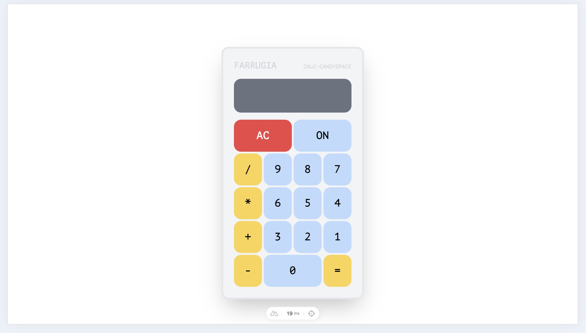
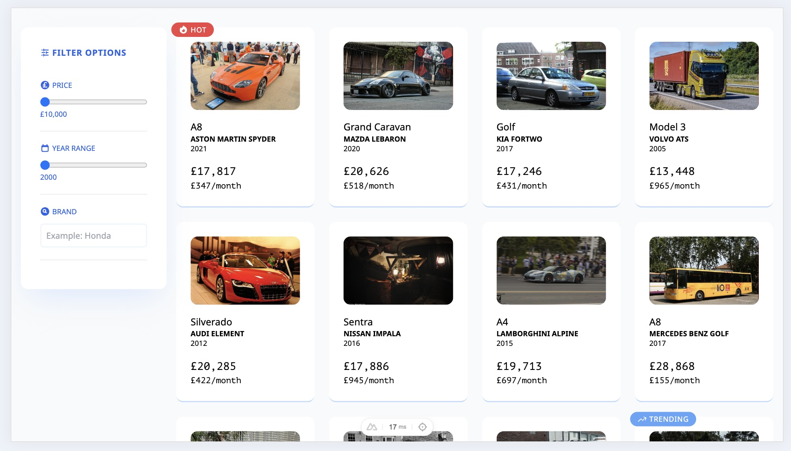

# Candyspace – Jose Farrugia Technical Task

## 🧮 1. Calculator



**Url:** https://localhost:3000/calculator

A simple calculator that allows the user to input digits and operators.

### Improvement Considerations:

- Separate out each mathematical operation into functions rather than relaying on `eval()`
- Add unit tests for each mathematical operation function
- Add more TypeScript type safety

## 🚙 2. Car Listing Page



**Url:** https://localhost:3000/cars

A fictional car listing page mocked with a MirageJS API endpoint. Each car item displays the brand, model, year, price,
price per month and an image of the vehicle.

Moreover, a filter options panel is located on the left hand side on larger screen displays and at the bottom on mobile
devices which allows the user to filter by price, year and brand.

Technical Implementation:

- With Pinia

### Improvement Considerations:

- Add unit and feature/end-to-end testing
- Add modal pop-up for additional details
-
    - Add more TypeScript type safety

## Setup

Make sure to install the dependencies:

```bash
# npm
npm install

# pnpm
pnpm install

# yarn
yarn install

# bun
bun install
```

## Development Server

Start the development server on `http://localhost:3000`:

```bash
# npm
npm run dev

# pnpm
pnpm run dev

# yarn
yarn dev

# bun
bun run dev
```

## Production

Build the application for production:

```bash
# npm
npm run build

# pnpm
pnpm run build

# yarn
yarn build

# bun
bun run build
```

Locally preview production build:

```bash
# npm
npm run preview

# pnpm
pnpm run preview

# yarn
yarn preview

# bun
bun run preview
```

Check out the [deployment documentation](https://nuxt.com/docs/getting-started/deployment) for more information.
